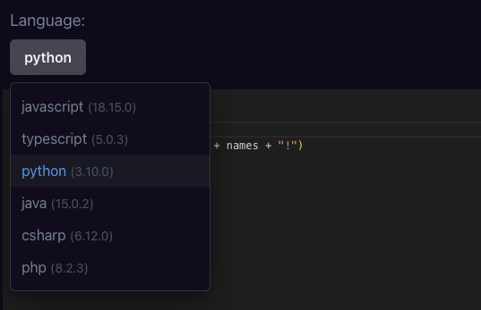
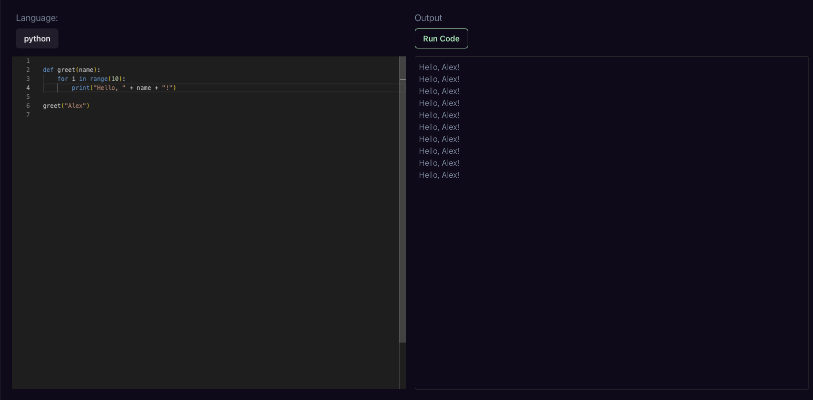
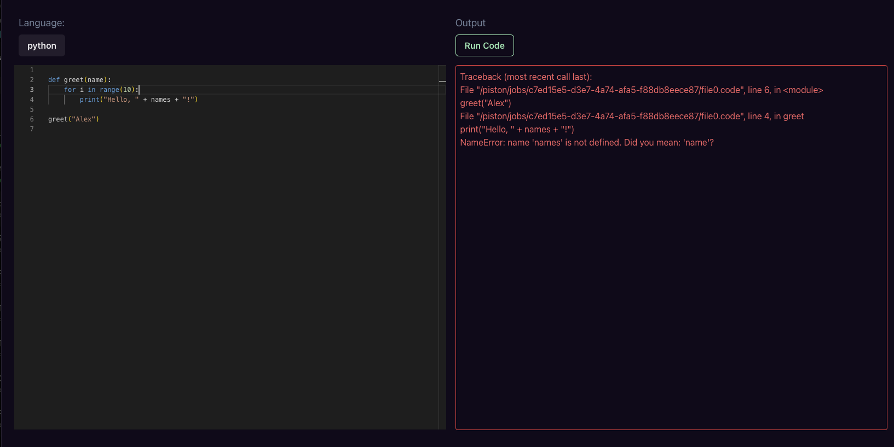

# Code Editor
A browser-based code editor that enables you to write and run code directly in your web browser.

## Features
1. Built-in programming languages (Javascript, Python ,Typescript, PHP etc.)
2. Boilerplate Code template
3. Syntax highlighting
4. Display output and debugging error

## Libraries
1. Piston API - A verstaile code execution platform to run and test code
2. React Monaco-Editor - A library to build code editor UI without complex configuration
3. Chakra UI - A simple, modular component libraries for React to style and build UI components

## Getting Started
1. Download project folder
2. Run `npm install` to install dependencies
3. Run `npm run dev` in project folder to start dev server
4. Access the localhost in browser

## Screenshots

### Select Coding Langugage

### Display Output

### Display Debugging Error 

